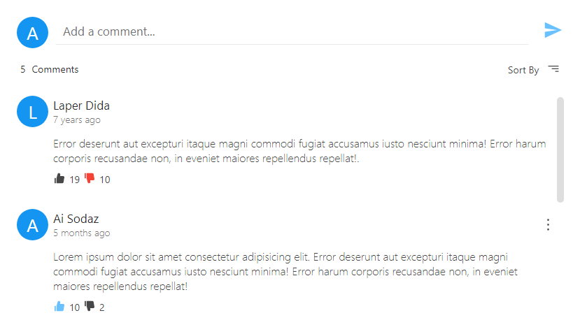
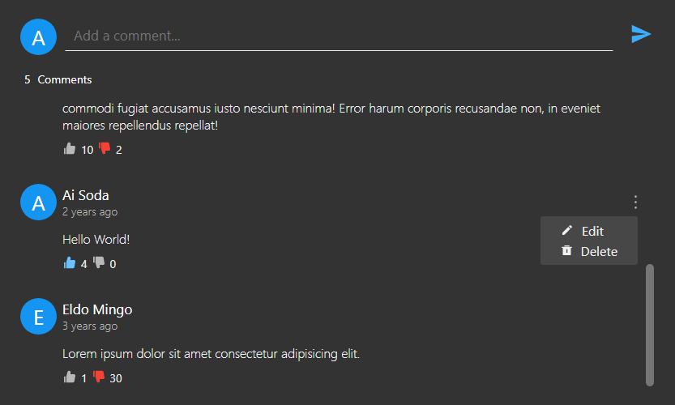
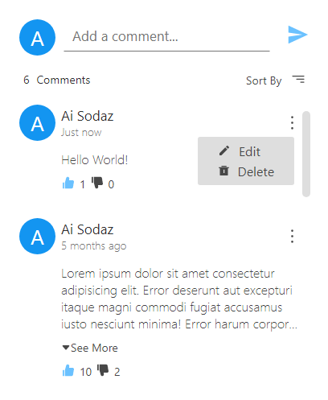
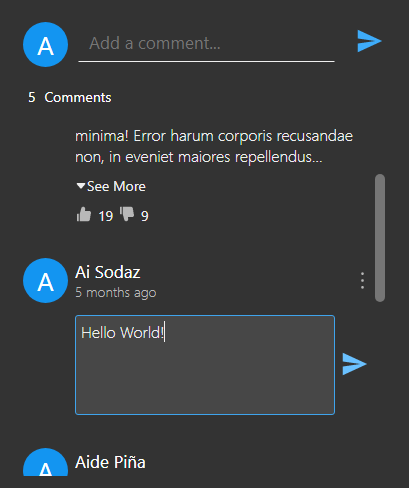

<h1 align='center'>Easy Comments - <i>Alpha</i></h1>

<p align='center'></p>

<h2 align='center'>Create comment sections easily</h2>
<br>

It's a simple library with that you can create a React Comment Sections Component.

<p align='center'></p>
<p align='center'></p>
<div style='display: flex; justify-content: space-around'><p></p>
<p></p></div>

## To-do

* [ ] Implement the options props
* [ ] Show comments without being logged in
* [ ] More colors for Avatars
* [ ] Testing

### Install

```bash
npm i @slydragonn/react-easy-comments
```

### Usage

```js
import { CommentsSection } from '@slydragonn/react-easy-comments'
```

* __CommentsSection__ accepts four props, but the last is optional.

#### Example

```tsx
import React from 'react'
import { CommentsSection, EasyComment } from '@slydragonn/react-easy-comments'
import { User, Comments, doSomething } from 'example'

export default function App {
  return (
    <main>
      <h1>My Comments Section</h1>
      <CommentsSection
        currentUser={{
          id: User.id,
          name: User.name,
          likes: User.likes,
          dislikes: user.dislikes,
          avatarUrl: User.image,
          profileLink: User.link
        }}
        initialComments={[
          Comments,
          (commentElement: any): EasyComment => ({
            commentId: commentElement.id,
            userId: commentElement.user.id,
            username: commentElement.user.name,
            comment: commentElement.text,
            creationDate: commentElement.date,
            likes: commentElement.info.likes,
            dislikes: commentElement.info.dislikes,
            avatarUrl: commentElement.user.image,
            profileLink: commentElement.user.link
          })
        ]}
        listeners={{
          onSubmit: (comment) => dosomething(comment),
          onUpdate: (comment) => dosomething(comment),
          onDelete: (comment) => dosomething(comment)
        }}
        options={{}}
      />
    </main>
  )
}

export default App

```

* __currentUser__: Accept an object with these properties. The dislikes and likes properties are arrays with the comment id that the current user like or disliked.

```ts
currentUser {
  id: string,
  name: string,
  likes?: string[],
  dislikes?: string[],
  avatarUrl?: string,
  linkProfile?: string 
}
```

* __initialComments__: It's an Array that accepts two elements. The first is the array that contains the comments for the section and the second element is a function that maps the list of comments of the first element and passes as param the array elements.

  ```ts
  initialComments: []

  comments: any[]
  (commentElement: any) => EasyComment

  ```

  * __EasyComment__: Is the type of object that should be returned by the function passed as the second element of the initialComments array.

    ```ts
    EasyComments {
      commentId: string
      userId: string
      username: string
      comment: string
      creationDate?: string | Date
      likes?: number
      dislikes?: number
      avatarUrl?: string
      profileLink?: string
      }
    ```

* __listeners__: It's an object with three properties and represents the different actions of the comments section. All functions are async, so you can pass instructions that are relational with APIs and Databases.

  ```ts
    listeners = {
      onSubmit: (comment) => void,
      onUpdate: (comment) => void,
      onDelete: (comment) => void
    } | {
      onSubmit: async (comment) => await dosomething(comment),
      onUpdate: async (comment) => await dosomething(comment),
      onDelete: async (comment) => await dosomething(comment)
    }
  ```
